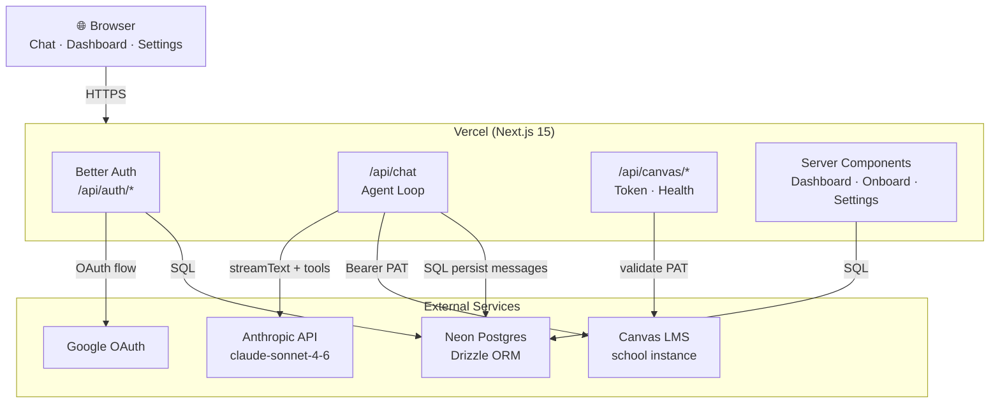
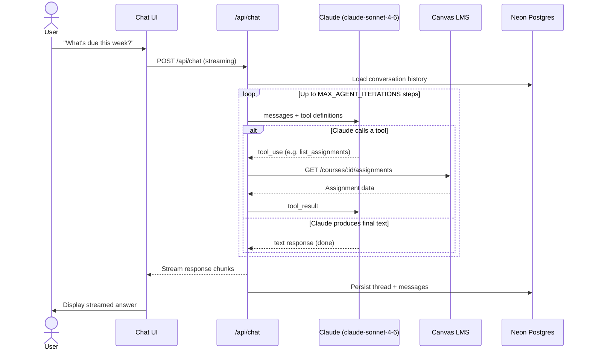
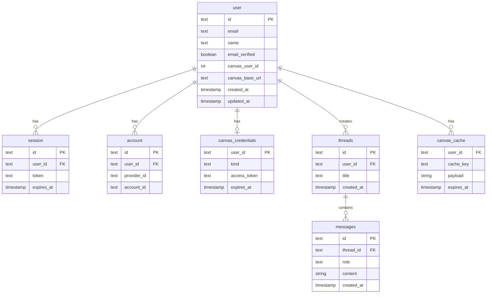
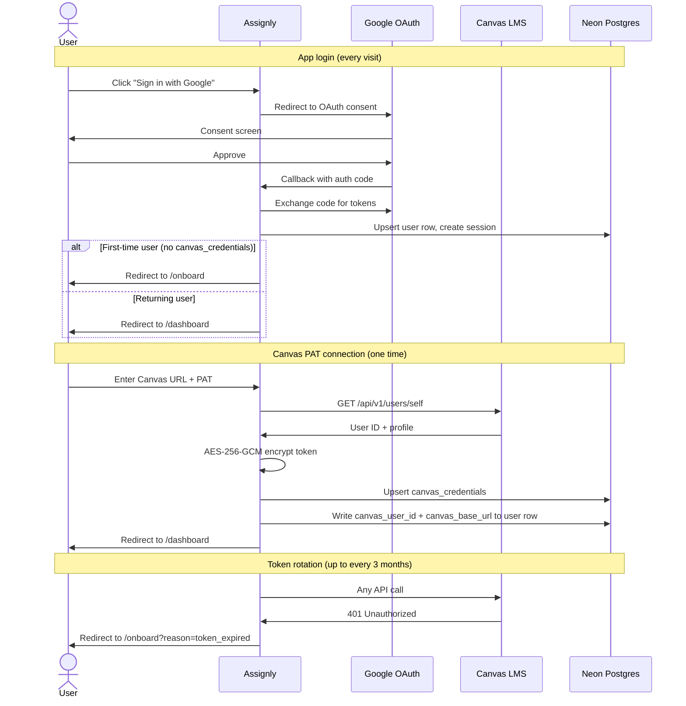

# Assignly — Architecture

A web-based AI assistant for university students. Students log in with Google, connect their Canvas account via a Personal Access Token, and chat with an agent that can read their courses, assignments, grades, and calendar to answer questions, plan their week, draft outlines, and quiz them on material.

## Goals and non-goals

**Goals**

- Ship a polished, live, public web app that real students could use.
- Showcase modern AI engineering: function-calling agent, streaming chat, secure third-party API integration.
- Be production-quality enough to anchor a resume: tests, CI, deployed link, clean repo.

**Non-goals (v1)**

- No write operations into Canvas (submitting assignments, posting to discussions). Read-only keeps scope tight and the threat model simple.
- No multi-LLM support. Anthropic Claude only. Switching models is a one-line change in the agent config.
- No native mobile app. Mobile-friendly web only.
- No Canvas OAuth. Instructure does not issue developer keys to individual developers. Canvas connection is PAT-only.

## Tech stack

| Layer | Choice | Why |
|---|---|---|
| Frontend + backend | Next.js 15 (App Router) + TypeScript | One repo, one deploy target, server components for free SSR, route handlers for the API. Hiring managers know it. |
| UI | Tailwind CSS + shadcn/ui | Looks good out of the box, no reinventing components. |
| AI orchestration | Vercel AI SDK (`ai` package) with Anthropic provider (`@ai-sdk/anthropic`) | First-class tool calling, streaming, and React hooks. Claude is the model. `claude-sonnet-4-6` for the agent loop — excellent at multi-step tool use. |
| Auth | Better Auth with Google OAuth | App-level login. Better Auth has native Drizzle + Neon support and strong TypeScript inference. Google OAuth is universally available to students without admin approval. |
| Database | Postgres on Neon | Free tier, serverless-friendly, branches per PR if you want fancy CI. |
| ORM | Drizzle | Lightweight, SQL-first, great TypeScript inference. |
| Hosting | Vercel | Free, fast, integrates with Next.js, gives you a clickable URL for your resume. |
| Tests | Vitest (unit), Playwright (E2E) | Modern defaults. |
| CI | GitHub Actions | Lint, typecheck, test on every PR. |

## High-level diagram



## Components

### Frontend

- **Landing page** — value prop, "Sign in with Google" and "Try Demo" CTAs.
- **Onboarding** — after Google sign-in, first-time users are prompted to connect Canvas by pasting a Personal Access Token and their school's Canvas URL. This screen is skipped on subsequent visits once a token is stored.
- **Chat** — streaming chat with tool-call rendering ("Looked up your CS 320 assignments…"), conversation history in the sidebar.
- **Dashboard** — week view of upcoming assignments and a course list. Nice to have, not strictly required for v1.
- **Settings / account page** — shows the current Canvas connection status and provides an "Update Canvas Token" button for when the PAT expires.

### Backend (Next.js Route Handlers)

- `POST /api/chat` — streams responses, runs the agent loop, persists messages.
- `GET/POST /api/auth/*` — Better Auth endpoints (Google OAuth login, callback, session).
- `POST /api/canvas/token` — accepts `{ canvasBaseUrl, accessToken }`, validates the token against Canvas `/api/v1/users/self`, encrypts and upserts the `canvas_credentials` row, and writes `canvas_user_id` + `canvas_base_url` back to the `user` row. Used for both initial setup and token rotation.
- `GET /api/canvas/health` — returns `{ ok: true, expiresAt }` if the stored token is still valid. Used by the settings page to show connection status.

### Canvas client

A thin TypeScript wrapper around Canvas's REST API. Handles:

- PAT authentication (`Authorization: Bearer <token>`). Token is decrypted from `canvas_credentials` on each request — never cached in memory between requests.
- Pagination (Canvas returns `Link` headers with `next`).
- Rate-limit handling (Canvas signals via `X-Rate-Limit-Remaining`).
- A small in-memory + Postgres cache layer keyed by `(user_id, endpoint, params)` with a short TTL (60s–5min depending on endpoint). Saves money on OpenAI tool calls and is kind to Canvas.

### Agent loop

Vercel AI SDK's `streamText` with `tools` does most of the work. The Anthropic provider is a one-line swap from other providers. Conceptually:

```
while (not done and iterations < MAX):
    response = claude.chat(messages, tools=tool_specs)
    if response.tool_calls:
        for call in response.tool_calls:
            result = await canvasClient[call.name](call.args)
            messages.append({ role: 'tool', tool_call_id: call.id, content: result })
    else:
        stream response back to user
        done = True
```

Model: `claude-sonnet-4-6` — handles multi-step tool use well and is the right balance of capability and cost for this use case.

`MAX` should be ~8 iterations per user turn — enough for a multi-step plan, not so many that a runaway loop bankrupts you.

In code, the provider import looks like:
```ts
import { anthropic } from "@ai-sdk/anthropic";
import { streamText } from "ai";

const result = await streamText({
  model: anthropic("claude-sonnet-4-6"),
  tools,
  maxSteps: MAX_AGENT_ITERATIONS,
  messages,
  system: systemPrompt,
});
```

### Agent loop sequence



### Tool catalog

These are the tools the agent has access to. Each is a thin wrapper around the Canvas client.

| Tool | Purpose |
|---|---|
| `list_courses` | Active courses for the current term. |
| `list_assignments` | Filterable by course, due window, submission status. |
| `get_assignment` | Full details: description, rubric, submission state. |
| `list_announcements` | Recent announcements, optionally per course. |
| `get_calendar` | Calendar events in a date range. |
| `list_modules` | Course modules and their items (readings, files, quizzes). |
| `get_grades` | Current grades per course. |
| `search_files` | Search uploaded course files (PDFs, slides) by name. |

Don't over-design this upfront — start with `list_assignments`, `list_courses`, `get_calendar`, and add the rest when the agent needs them.

## Data model



### Table reference

```sql
-- Better Auth core tables (managed by Better Auth, do not edit manually)
user (
  id              text primary key,        -- UUID string generated by Better Auth
  name            text not null,
  email           text not null unique,
  email_verified  boolean not null,
  image           text,
  created_at      timestamptz not null,
  updated_at      timestamptz not null,
  -- Custom fields for Canvas connection
  canvas_user_id  bigint,
  canvas_base_url text                     -- e.g. https://canvas.your-school.edu
)

session (id, expires_at, token, user_id, ...)
account (id, account_id, provider_id, user_id, ...)
verification (id, identifier, value, expires_at, ...)

-- Canvas PAT credentials, encrypted at rest
canvas_credentials (
  user_id      text references user(id),
  kind         text check (kind = 'pat') default 'pat',
  access_token text not null,              -- AES-256-GCM ciphertext, base64-encoded
  expires_at   timestamptz,               -- optional; Canvas doesn't expose this via API
  primary key (user_id)
)

-- chat
threads (
  id          uuid primary key,
  user_id     text references user(id),
  title       text,                        -- auto-generated from first message
  created_at  timestamptz
)

messages (
  id          uuid primary key,
  thread_id   uuid references threads(id),
  role        text,                        -- 'user' | 'assistant' | 'tool' | 'system'
  content     jsonb,                       -- string or structured tool call/result
  created_at  timestamptz
)

-- optional cache, can be in-memory only for v1
canvas_cache (
  user_id    text,
  cache_key  text,
  payload    jsonb,
  expires_at timestamptz,
  primary key (user_id, cache_key)
)
```

## Auth flow



**App login (Google OAuth):**

1. User clicks "Sign in with Google" on the landing page.
2. Better Auth redirects to Google's OAuth consent screen.
3. Google redirects back to `/api/auth/callback/google`.
4. Better Auth creates or updates the `user` row and sets a session cookie.
5. If the user has a `canvas_credentials` row, they go straight to `/chat`. If not, they go to `/onboard`.

**Canvas connection (PAT — one time):**

1. First-time user lands on `/onboard` after Google sign-in.
2. UI shows instructions: Canvas → Account → Settings → New Access Token.
3. User enters their school's Canvas URL (e.g. `https://canvas.university.edu`) and pastes the token.
4. `POST /api/canvas/token` validates the token against Canvas `/api/v1/users/self`, encrypts it with AES-256-GCM, and upserts the `canvas_credentials` row.
5. `canvas_user_id` and `canvas_base_url` are written to the `user` row.
6. User is redirected to `/chat`. They will never see this screen again unless their token expires.

**Subsequent visits:**

- User signs in with Google → session restored → `canvas_credentials` row exists → straight to `/chat`.
- No re-entering the Canvas token.

**Token rotation (when PAT expires, up to every 3 months):**

1. Canvas PATs have a maximum lifetime of 3 months (user-configurable at creation).
2. When a Canvas API call returns 401, the app clears the stored credential and redirects to `/onboard?reason=token_expired` with a message explaining what happened.
3. The user can also proactively update their token at any time via Settings → "Update Canvas Token", which hits the same `POST /api/canvas/token` endpoint.

## Security and privacy

- **Token encryption** — Canvas PATs are equivalent to a password. Encrypt at rest with AES-256-GCM using a 32-byte key stored in Vercel env vars (`TOKEN_ENCRYPTION_KEY`). Never log them.
- **OpenAI data handling** — be honest in the privacy policy: assignment content goes to OpenAI. Use the OpenAI API (not ChatGPT) and rely on its no-training-on-API-data default.
- **No PII beyond what's needed** — store Canvas user ID, name, email. Don't mirror assignments or grades into your DB; fetch on demand and cache short.
- **Per-user rate limits** — protect both your OpenAI bill and the Canvas API. A simple in-memory sliding window for v1; Upstash Redis if you need multi-instance correctness.
- **CSRF, secure cookies, HTTPS-only** — Better Auth handles this by default.

## Cost model (rough)

- Single model: `claude-sonnet-4-6` for all agent turns.
- Average user turn: ~3 tool calls, ~4k input tokens, ~600 output tokens.
- At claude-sonnet-4-6 pricing this is a few cents per turn for heavy users, well under $1/day for typical usage. 100 active users comfortably under $50/month.
- Set hard per-user daily token caps so a single bad actor can't drain your account.
- If cost becomes a concern, `claude-haiku-4-5-20251001` can handle simple single-step queries cheaply — but don't optimise this prematurely.

## Repo layout

```
assignly/
├─ app/                         # Next.js App Router
│  ├─ (marketing)/
│  ├─ (app)/
│  │  ├─ chat/
│  │  ├─ dashboard/
│  │  └─ settings/
│  └─ api/
│     ├─ chat/route.ts
│     ├─ auth/[...all]/route.ts  # Better Auth handler
│     └─ canvas/
│        ├─ token/route.ts       # PAT setup + rotation
│        └─ health/route.ts
├─ lib/
│  ├─ canvas/                   # Canvas REST client + demo client
│  ├─ agent/                    # tool definitions + loop
│  ├─ auth/                     # Better Auth config + client
│  ├─ db/                       # Drizzle schema + queries
│  └─ crypto.ts                 # token encryption helpers
├─ components/
├─ tests/
├─ drizzle/                     # migrations
├─ .github/workflows/ci.yml
└─ README.md
```

## Suggested build order (4–6 weekends)

1. **Weekend 1 — scaffold.** Next.js + Tailwind + shadcn + Better Auth skeleton with Google OAuth. Postgres on Neon. Drizzle schema. Deployed to Vercel with a placeholder page. ✅ *Done.*
2. **Weekend 2 — Canvas PAT connection.** Token paste flow, encrypted storage, Canvas client with `list_courses` and `list_assignments`. A dashboard that just lists your real courses proves the integration works. "Update token" flow in settings.
3. **Weekend 3 — chat MVP.** `/api/chat` with the AI SDK, one tool wired up (`list_assignments`), streaming UI. Get to "what's due this week?" working end-to-end.
4. **Weekend 4 — agent loop and more tools.** Multi-step loop, add `get_calendar`, `get_assignment`, `list_announcements`. Persist threads and messages. Demo mode.
5. **Weekend 5 — polish.** Caching, rate limiting, error states (including 401 → reconnect flow), mobile layout, conversation history sidebar.
6. **Weekend 6 — production-grade extras.** Tests, GitHub Actions CI, README with architecture diagram and a 30-second demo GIF, custom domain.

## Resume-grade extras

- **README.md** — short pitch, architecture diagram (steal from this doc), live demo link, screenshots, "how it works" section calling out the agent loop and tool design.
- **Demo video** — 60–90 seconds, narrated, on Loom or as a GIF in the README. Most reviewers won't run your code; they'll watch your demo.
- **One non-trivial test** — an integration test of the agent loop using mocked Canvas responses. Shows you can test AI code, which most candidates can't.
- **Write-up post** — a short blog post or repo notes describing one hard decision (e.g., "why we don't store Canvas data," "designing tools for an LLM agent"). Recruiters love evidence of thinking.

## Open questions to nail down as you go

- How aggressive should the agent be about *proactive* behavior? (e.g., "I notice you have a paper due in 36 hours and haven't opened the rubric yet" — cool, but creepy if unrequested.)
- Will you show a token expiry warning in the UI? Canvas doesn't return the PAT's expiry date via API — you'd need to either ask the user at setup time ("when does your token expire?") or just rely on the 401 redirect.
